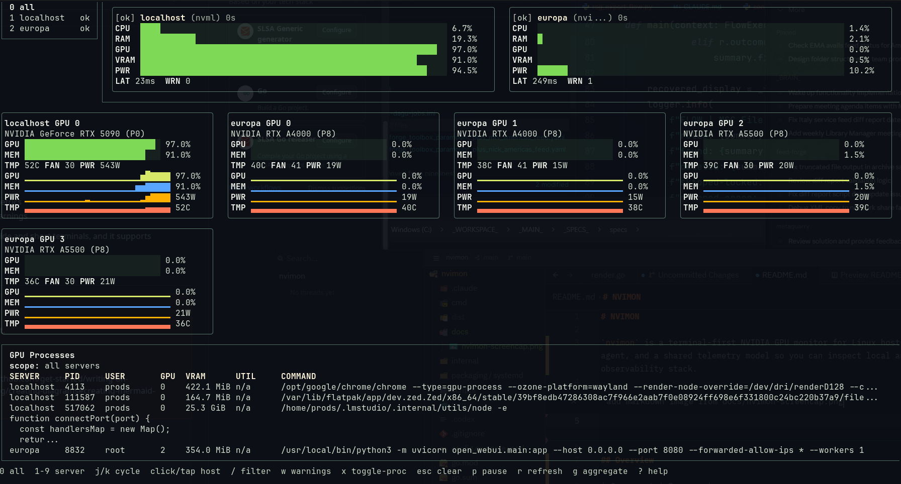
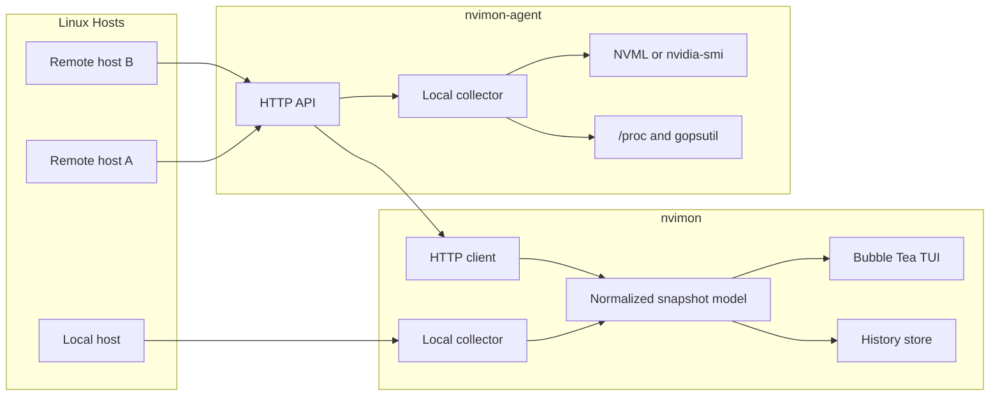

# NVIMON

`nvimon` is a terminal-first NVIDIA GPU monitor for Linux hosts. It combines a Bubble Tea TUI, a lightweight remote agent, and a shared telemetry model so you can inspect local and remote machines without a browser or a full observability stack.



## 🧭 Overview

| Component | Purpose |
| --- | --- |
| `nvimon` | Interactive terminal UI for local and remote monitoring |
| `nvimon-agent` | Lightweight HTTP agent for remote Linux hosts |
| Shared model and collectors | Normalized host, GPU, and process telemetry |

## 📊 What It Shows

| Area | Metrics / Views |
| --- | --- |
| Host health | CPU usage, RAM usage, uptime, load average, connection state, collector latency, warnings |
| GPU fleet view | Aggregate GPU usage bars, per-host GPU counts, backend name |
| Per-GPU detail | Compute utilization, VRAM usage, temperature, fan speed, power draw, power limit, clocks, pstate/profile |
| GPU processes | Active GPU-using processes only, including PID, user, command, GPU index, and VRAM usage |
| History | Short-window charts for key GPU metrics |

The UI is designed to stay usable on both wide and short terminals, with mouse and touch support for switching hosts.

## 🏗️ Architecture



The core design choice is a single normalized snapshot model. The TUI does not need to care whether data came from the local machine or from a remote agent.

## ⚙️ Backends

| Mode | Description | Best Use |
| --- | --- | --- |
| `local-nvml` | CGO-enabled build with NVIDIA NVML bindings | Native builds on compatible target hosts |
| `portable` | CGO-disabled build that falls back to `nvidia-smi` | Portable deployments and simpler distribution |

The default `make build` produces both variants:

| Artifact | Path |
| --- | --- |
| `nvimon` portable | `dist/portable/nvimon` |
| `nvimon-agent` portable | `dist/portable/nvimon-agent` |
| `nvimon` NVML | `dist/local-nvml/nvimon` |
| `nvimon-agent` NVML | `dist/local-nvml/nvimon-agent` |

The installer chooses the artifact that can actually run on the target host.

### Choosing Between `portable` and `local-nvml`

Use `portable` when you want the least fragile deployment. It is built with `CGO_ENABLED=0`, does not require NVML headers or a host-native CGO toolchain at build time, and collects GPU data by shelling out to `nvidia-smi`. That makes it easier to ship across mixed Linux hosts and simpler to install in automation. The tradeoff is that it depends on `nvidia-smi` being present in `PATH`, and process-level data is limited to what `nvidia-smi` exposes.

Use `local-nvml` when you control the target host and want direct NVML access. It is a CGO-enabled build linked against NVIDIA's NVML bindings, so it can talk to the driver library directly instead of spawning `nvidia-smi` for the primary collection path. That usually makes it the better fit for native installs on NVIDIA-equipped machines, but it is less portable and more sensitive to host build/runtime compatibility.

In practice:

| Variant | Pros | Cons | Good Default When |
| --- | --- | --- | --- |
| `portable` | Easiest to distribute, no CGO requirement, works well for remote installs and mixed fleets | Requires `nvidia-smi`; indirect collection path; less ideal if you want the most native integration | You want one build that is likely to run everywhere NVIDIA tools are already installed |
| `local-nvml` | Direct NVML access, native integration, preferred when the host is known-good for NVML | Requires CGO/native compatibility; less portable across hosts | You manage the machine yourself and can rely on NVIDIA driver/NVML availability |

Even the `local-nvml` build is not all-or-nothing: if NVML cannot initialize at runtime, nvimon falls back to `nvidia-smi` and records that fallback in collector warnings.

## 🗂️ Data Collected

### 🖥️ Host Snapshot

| Field | Notes |
| --- | --- |
| Hostname | Reported host identity |
| Connection state | Local or remote availability state |
| Collector latency | Collection round-trip timing |
| Collector warnings | Backend or collection issues |
| CPU usage | Per-host CPU utilization |
| RAM used / total | Memory pressure at a glance |
| Uptime | Host runtime |
| Load average | When available |
| Total GPU count | Number of visible GPUs |
| GPU backend name | `nvml`, `nvidia-smi`, or equivalent |

### 🎮 GPU Snapshot

| Field | Notes |
| --- | --- |
| Index and UUID | Stable device identity |
| Product name | GPU model |
| VRAM used / total | Memory usage |
| Compute utilization | SM or equivalent utilization |
| Temperature | Thermal state |
| Fan speed | When available |
| Power draw / limit | Power usage and cap |
| Clock data | When available |
| Pstate / profile | Performance state |

### 🧵 GPU Process Snapshot

| Field | Notes |
| --- | --- |
| PID | Process ID |
| User | Owning user |
| Command | Process command |
| GPU index | Attached GPU |
| VRAM used | Per-process GPU memory |
| Per-process utilization fields | When exposed by the backend |

Unavailable fields are shown as unknown rather than faked as zero.

## 🔨 Build

| Command | Result |
| --- | --- |
| `make build` | Build both variants into `dist/` and copy a default config to `dist/nvimon.config.yaml` |
| `make build-portable` | Build the portable `nvidia-smi` variant only |
| `make build-native` | Build the CGO/NVML-enabled variant only |

## ▶️ Run

| Task | Command |
| --- | --- |
| Launch the TUI locally | `./dist/portable/nvimon` |
| Print one snapshot in text mode | `./dist/portable/nvimon --once` |
| Print one snapshot as JSON | `./dist/portable/nvimon --once --json` |
| Query a remote agent directly | `./dist/portable/nvimon --remote-snapshot http://host:9910 --remote-token TOKEN --json` |
| Run the agent | `./dist/portable/nvimon-agent --config ./config.example.yaml` |

## 🌐 Remote Install

Paste one of these on the target machine:

### Install Client

```bash 
<(curl -fsSL https://raw.githubusercontent.com/latentarts/nvimon/main/scripts/remote-install.sh) client`
```

### Install Server Agent

```bash 
<(curl -fsSL https://raw.githubusercontent.com/latentarts/nvimon/main/scripts/remote-install.sh) client`
```

What the bootstrap installer does:

| Mode | Behavior |
| --- | --- |
| `client` | Downloads the repo, builds `nvimon`, installs it to `~/.local/bin`, and creates `~/.config/nvimon/config.yaml` if missing |
| `server` | Downloads the repo, builds the agent artifacts, runs the existing service installer, and prompts for the listen IP and port before restarting the service |

## 🧾 Configuration

The main config file is YAML. By default, `nvimon` reads `~/.config/nvimon/config.yaml`, or you can override it with `--config`.

```yaml
refresh_interval: 1s
history_length: 120

agent:
  bind_address: 0.0.0.0:9910
  auth_token: ""

hosts:
  - name: local
    mode: local
  - name: server
    mode: remote
    url: http://10.0.0.25:9910
    token: ""
```

What it does:

| Step | Behavior |
| --- | --- |
| Binary selection | Looks under `dist/` and prefers `dist/local-nvml/nvimon-agent` when it can run |
| Fallback | Uses `dist/portable/nvimon-agent` if the NVML build is not suitable |
| Install path | Installs the binary to `/usr/local/bin` |
| Service setup | Installs, enables, and restarts the systemd unit |
| Updates | Replaces the installed agent safely when a newer binary is present |

During install, the script prompts for the IP and port to bind. This is useful on multi-homed servers where `127.0.0.1:9910` is not the right default.

The systemd unit template lives at `packaging/systemd/nvimon-agent.service`.


What it does:

| Step | Behavior |
| --- | --- |
| Binary selection | Prefers `dist/local-nvml/nvimon` when it can run, otherwise falls back to `dist/portable/nvimon` |
| Install path | Installs the binary to `~/.local/bin` by default |
| Config setup | Creates `~/.config/nvimon/config.yaml` if it does not already exist |
| Existing config | Leaves an existing config file untouched |

## ⌨️ UI Controls

| Key | Action |
| --- | --- |
| `0` | Select all hosts |
| `1-9` | Select a specific host |
| `j` / `k` | Cycle host scope |
| `x` | Toggle the GPU process pane |
| `/` | Start process filtering |
| `w` | Open the warnings dialog |
| `g` | Cycle aggregate mode |
| `p` | Pause refresh |
| `r` | Refresh immediately |
| `?` | Toggle help |
| Click or tap | Select a host row |

## 🗃️ Repository Layout

| Path | Purpose |
| --- | --- |
| `cmd/nvimon` | TUI entrypoint |
| `cmd/nvimon-agent` | Agent entrypoint |
| `internal/collector` | Local telemetry collection |
| `internal/model` | Normalized snapshot structs and formatting |
| `internal/history` | Ring buffers and time-series storage |
| `internal/transport/httpapi` | Agent HTTP server and client |
| `internal/tui` | Bubble Tea UI and rendering |
| `scripts/install-client.sh` | Local CLI install script |
| `scripts/install-agent.sh` | Linux agent install and update script |
| `scripts/remote-install.sh` | Bootstrap installer for client and server machines |
| `packaging/systemd/nvimon-agent.service` | Systemd unit template |

## 🚧 Status

The project is functional and evolving toward a more polished multi-host GPU monitoring workflow. Current work is focused on improving information density, usability, and deployment ergonomics without losing the compact terminal-first model.


## 🤖 Transparency
**Note on AI Usage:** While AI coding agents were used as a force multiplier for boilerplate and specific implementations, the architecture, logic flow, and final codebase were driven and validated by a human developer. This project is a human-led effort using AI as a sophisticated tool.

---

## 📜 License

MIT License. See [LICENSE](LICENSE) for details.
